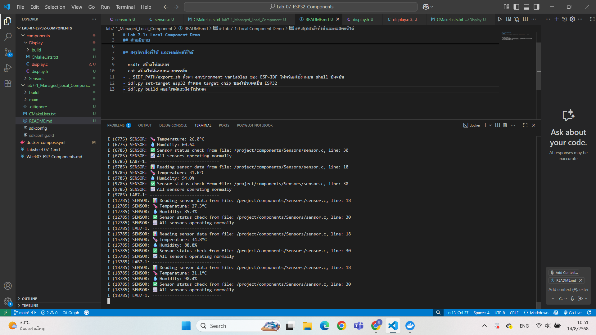

# Lab 7-1: Local Component Demo

## คำอธิบาย
การทดลองนี้แสดงการใช้งาน component ที่มีอยู่ในโฟลเดอร์ `components/Sensors/` ของ project

## สรุปคำสั่งที่ใช้ และผลลัพธ์ที่ได้

- mkdir สร้างโฟลเดอร์
- cat สร้างไฟล์แบบหลายบรรทัด
- . $IDF_PATH/export.sh ตั้งค่า environment variables ของ ESP-IDF ให้พร้อมใช้งานบน shell ปัจจุบัน
- idf.py set-target esp32 กำหนด target chip ของโปรเจคเป็น ESP32
- idf.py build คอมไพล์และลิงก์โปรเจค

